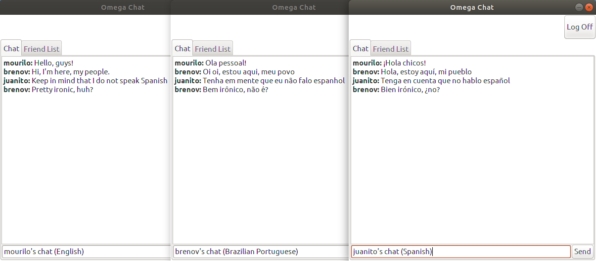

---

# Omega

## Description

**Omega** is a software that provides online chatting, with other people, having a feature of automatic simultaneous translation of messages.

Users have to specify the host's IP address, their username and their language before entering the chat. Once they're in, all the messages will be received in the user's language (if the translation succeeded). The users may send their messages in their language (the language they chose, when entering), because it's going to get to be translated to everyone else in the chat. To perform the translation this application uses the Google Translator Web Service.

This project is, also, for the course of Distributed Programming, of the Federal University of Rio Grande do Norte (UFRN).

## Features and TO DOs

- [x] Java RMI for client and server communication (course's requirement)
- [x] Google Cloud Translation API in the translation process
- [x] Swing Graphical User Interface
- [ ] Database usage
- [ ] Friends list
- [ ] Chat rooms

## Supported Languages

- Portuguese
- English
- Spanish
- German
- French
- Italian
- Dutch

## Dependencies

- Java 8.0 or greater

## Demonstration

## Team

 | 
---|---
[Breno Viana](https://github.com/brenomfviana) | [Murilo Bento](https://github.com/murilobnt)
